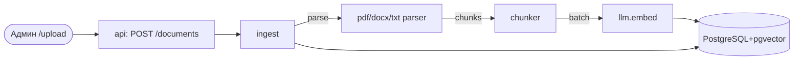
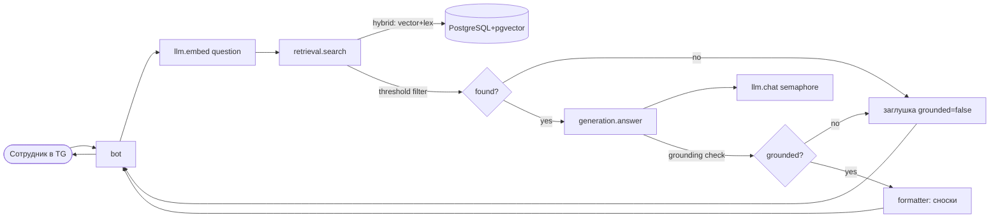

# Design — Корпоративный AI-ассистент (RAG), MVP

> Документ дизайна. Часть I — ER-схема, часть II — API-контракты (JSON),
> часть III — архитектура и границы модулей. Реализуется по бизнес-логике v2
> (MVP-подмножество). Стек: Python 3.12, FastAPI + aiogram 3 + SQLAlchemy 2
> (async) + pgvector, ручной RAG без LangChain, локальная Ollama
> (`qwen2.5:3b-instruct` + `nomic-embed-text`).

---

## I) ER-схема данных

### 1) `documents` — один загруженный файл

| Атрибут | Тип | Ключ | Описание | NULL | Ограничения |
|---|---|---|---|---|---|
| `id` | BIGSERIAL | PK | id документа | NOT NULL | — |
| `source_name` | VARCHAR(200) | | Имя файла/документа | NOT NULL | — |
| `document_type` | VARCHAR(4) | | Формат | NOT NULL | CHECK IN ('PDF','DOCX','TXT') |
| `version` | INT | | Версия документа | NOT NULL | DEFAULT 1, >= 1 |
| `active` | BOOLEAN | | Текущая (активная) версия | NOT NULL | DEFAULT true |
| `file_path` | TEXT | | Путь к оригиналу файла | NOT NULL | — |
| `created_at` | TIMESTAMPTZ | | Когда загружен | NOT NULL | DEFAULT now() |
| `updated_at` | TIMESTAMPTZ | | Когда обновлён | NULL | — |

### 2) `chunks` — нарезанные куски текста

| Атрибут | Тип | Ключ | Описание | NULL | Ограничения |
|---|---|---|---|---|---|
| `id` | BIGSERIAL | PK | id чанка | NOT NULL | — |
| `document_id` | BIGINT | FK → documents(id) | Источник-документ | NOT NULL | ON DELETE RESTRICT |
| `chunk_index` | INT | | Порядковый номер чанка в документе | NOT NULL | UNIQUE(document_id, chunk_index) |
| `content` | TEXT | | Текст чанка | NOT NULL | — |
| `page` | INT | | Номер страницы | NULL | — |
| `section` | TEXT | | Секция/заголовок | NULL | — |
| `embedding` | vector(768) | | Векторное представление | NOT NULL | — |
| `tsv` | tsvector | | Полнотекстовый индекс | NOT NULL | GENERATED ALWAYS AS (to_tsvector('russian', content)) STORED |

### Индексы

| Поле | Тип индекса | Зачем |
|---|---|---|
| `embedding` | HNSW (операторный класс `vector_cosine_ops`, m=16, ef_construction=64) | Быстрый приближённый поиск ближайших векторов (косинус) — главный путь retrieval |
| `tsv` | GIN | Быстрый лексический (полнотекстовый) поиск — вторая часть гибридного поиска |
| `(document_id, chunk_index)` | UNIQUE B-tree | Покрывает и выборку чанков документа, и уникальность пары документ+индекс |

### Пояснения к решениям

- **Целочисленные `id` (BIGSERIAL), а не UUID.** Целые ключи компактнее (4–8 байт vs 16), быстрее индексируются и сравниваются. Аргумент про «меньше токенов для LLM» относится именно к `chunk_id` — он попадает в промпт при grounding.
- **`chunk_id` в БД — BIGSERIAL, префикс добавляется в коде.** В промпт подставляется токен вида `c42` (префикс `c` + числовой id). Это легко распарсить регуляркой `c(\d+)` при grounding-проверке и при этом не раздувать столбец PK в БД.
- **`ON DELETE RESTRICT` на FK.** Удаление документа блокируется, пока есть чанки. Это сохраняет историю/статистику и страхует от случайной потери данных. «Удаление» реализуется софт-флагом `documents.active = false`, а не физическим DELETE.
- **Неактивность чанка = неактивность документа.** Отдельный soft-delete-флаг на чанках не нужен: retrieval фильтрует `JOIN documents d ON d.id = c.document_id WHERE d.active = true`.
- **`tsv` через `GENERATED ALWAYS AS … STORED`.** Заполняется автоматически из `content` при INSERT/UPDATE, конфиг `'russian'`. Не требует триггеров. **Мультиязычность — post-MVP:** векторный поиск уже мультиязычный (nomic-embed-text), а лексический ограничен русским стеммингом; для иностранного корпуса заменить конфиг на `'simple'` (без стемминга) или multi-config. Для MVP бизнес-кейса (русские регламенты) `'russian'` оптимален.
- **HNSW над IVFFlat:** база небольшая (десятки тысяч чанков), важны recall и простота настройки; RAM на M5 (16 ГБ) это позволяет. IVFFlat выгоден на очень больших базах и требует калибровки числа кластеров.

---

## II) API-контракты (JSON)

### 1) Admin upload

`POST /documents` (multipart/form-data) — админ загружает файл, система парсит, чанкует, индексирует.

Request (multipart):
```json
{ "file": "<binary PDF/DOCX/TXT>", "section_tag": "Отпуска (опц.)" }
```

Response `200 OK`:
```json
{
  "document_id": 12,
  "source_name": "reglament_otpuskov.pdf",
  "document_type": "PDF",
  "chunks_created": 47,
  "status": "indexed"
}
```

Ошибки:
- `400` — неподдерживаемый формат / не из CHECK-списка;
- `422` — пустой файл или не удалось извлечь текст;
- `503` — Ollama/БД недоступны.

### 2) Retrieve — внутренний контракт модуля `retrieval`

Вызов: `retrieval.search(query: str, top_k: int) -> RetrieveResult`
Назначение: гибридный поиск (вектор + лексика) релевантных чанков; отсев по порогу релевантности.

Request (аргументы):
```json
{ "query": "За сколько дней подавать заявление на отпуск?", "top_k": 5 }
```

Response — релевантные чанки найдены:
```json
{
  "found": true,
  "results": [
    {
      "chunk_id": 142,
      "content": "Согласно п.4.1 заявление на оплачиваемый отпуск подаётся не позднее, чем за 14 дней...",
      "page": 4,
      "section": "Отпуска",
      "source_name": "reglament_otpuskov.pdf",
      "score": 0.73
    }
  ]
}
```

Response — ничего релевантного (все скоры ниже порога):
```json
{ "found": false, "results": [] }
```
> `found == false` — это триггер заглушки «в регламентах этого нет».

### 3) Generate — внутренний контракт модуля `generation`

Вызов: `generation.answer(question: str, context_chunks: list[ChunkResult]) -> GenerateResult`
Назначение: построить grounded-ответ строго по контексту; вернуть id чанков-источников.

Request:
```json
{
  "question": "За сколько дней подавать заявление на отпуск?",
  "context_chunks": [
    {
      "chunk_id": 142,
      "content": "Согласно п.4.1 заявление на оплачиваемый отпуск подаётся не позднее, чем за 14 дней...",
      "page": 4,
      "source_name": "reglament_otpuskov.pdf"
    }
  ]
}
```

Response — ответ с опорой на контекст:
```json
{
  "answer": "Заявление на оплачиваемый отпуск нужно подать не позднее, чем за 14 дней.",
  "cited_chunk_ids": [142],
  "grounded": true
}
```

Response — grounding провален (модель не опирается на контекст / нет контекста):
```json
{
  "answer": "В регламентах нет информации по этому вопросу. Обратитесь к HR-специалисту.",
  "cited_chunk_ids": [],
  "grounded": false
}
```
> `grounded == false` — бот отдаёт заглушку и не присылает сносок.

---

## III) Архитектура и границы модулей

### Ingest flow (наполнение базы знаний)



### Query flow (ответ сотруднику)



### Границы модулей — публичные интерфейсы (протоколы)

| Модуль | Публичные функции | Возвращает |
|---|---|---|
| `llm` | `embed(texts: list[str]) -> list[list[float]]` | батч эмбеддингов (через `/api/embed`, Ollama `nomic-embed-text`) |
| `llm` | `chat(messages: list[dict], *, temperature=0.0) -> str` | текст ответа; обёрнут в `asyncio.Semaphore(MAX_CONCURRENT_LLM)` |
| `ingest` | `parse_and_chunk(file_path: str, doc_type: str) -> list[ChunkMeta]` | чанки с `content, page, section, chunk_index` |
| `ingest` | `store(source_name, doc_type, file_path, chunks) -> int` | `document_id` (запись `documents` + батч-инсерт `chunks`) |
| `retrieval` | `search(query: str, top_k: int) -> RetrieveResult` | `{found, results: list[ChunkResult]}` (гибридный скор, порог из конфига) |
| `generation` | `answer(question, context_chunks) -> GenerateResult` | `{answer, cited_chunk_ids, grounded}` (prompt-builder + grounding-check) |
| `api` | `POST /documents` (FastAPI) | upload-контракт выше |
| `bot` | aiogram handlers (`/start`, свободный ввод, `/upload` для админа) | сообщение пользователю |

### Общие типы данных (dataclasses/Pydantic)

- `ChunkMeta` — `{chunk_index, content, page, section}` (внутри ingest, до эмбеддинга).
- `ChunkResult` — `{chunk_id, content, page, section, source_name, score}` (на выходе retrieval).
- `RetrieveResult` — `{found: bool, results: list[ChunkResult]}`.
- `GenerateResult` — `{answer: str, cited_chunk_ids: list[int], grounded: bool}`.

### Анти-галлюцинационный механизм (как куски соединяются)

1. `retrieval.search` отсекает чанки ниже порога → если `found == false`, заглушка сразу.
2. Иначе чанки попадают в `generation.answer`: промпт требует ссылаться токенами `c<chunk_id>`.
3. `grounding-check` парсит из ответа `c\d+`, сверяет с реально переданными `chunk_id`.
   - Все cited id в контексте → `grounded = true`.
   - Любой cited id вне контекта / пусто при наличии контекста → повторная генерация, затем `grounded = false` → заглушка.

### Зависимости между модулями (направление вызовов)

- `api → ingest → llm(embed), db`
- `bot → retrieval → llm(embed), db`
- `bot → generation → llm(chat), retrieval(чанк-результаты)`

Модули `db`, `llm` — нижний уровень, не зависят от верхних. `retrieval` и `generation`
не вызывают друг друга напрямую; `generation` работает с типом `ChunkResult`, который
производит `retrieval` — это и есть контрактная связка.
